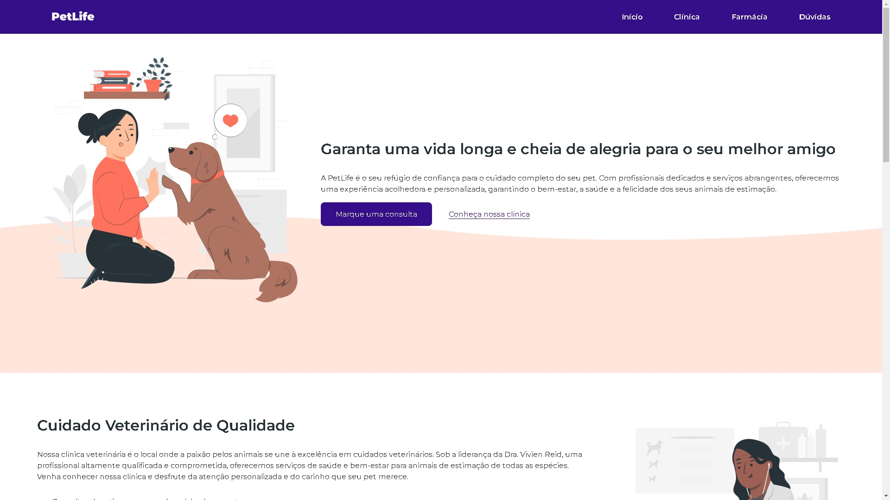

# Projeto PetLife
Este é um projeto de Clinica Veterinária desenvolvido com o objetivo de exibir minhas habilidades como Desenvolvedor Front-End. O projeto utiliza diversas tecnologias para criar uma interface moderna e funcional.

## Tecnologias Utilizadas 🚀

## Acesse o Projeto Online 🌐

[Veja o projeto no GitHub Pages](https://machadojorgeh.github.io/Projeto-PetLife/)
